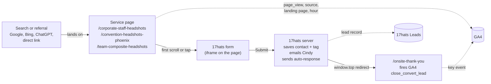

# Lead flow: from "Get a Quote" to a record you can see

Last updated: 2026-09-10. Companion page (diagram): https://claude.ai/code/artifact/c099383d-83e5-4393-8af0-5fb9749dbfef

This documents what happens when a visitor hits a page with a quote form, where each
piece of information lands, and where to look to answer **who, what, where, when**.

## The path

Step by step:

1. **Arrival.** Someone reaches a service page from search, an AI assistant, or a direct
   link. GA4 records the session: source, landing page, device, hour (Phoenix time).
2. **The form.** The 17hats "Request a Quote" iframe is not in the page at load. It
   mounts on the first scroll, touch, key, or mouse move, on a tap of "Open the form", or
   8 seconds after load (see `src/components/HatsFormLoader.tsx`). This keeps LCP fast.
3. **Submit.** The form posts to 17hats. 17hats creates the contact, applies the tag
   "on location headshots", emails Cindy the lead, and within about a minute sends the
   auto-response "CMQHEADSHOTS Onsite Quote" (subject: "Headshot Pricing information from
   CMQ HEADSHOTS"). That email carries the link to `/staff-headshot-pricing`, the web
   version of the on-site quote. Views of that page are almost all quote recipients.
4. **Redirect.** 17hats' "After Submitting: Go to URL" uses a top-window navigation
   (`window.top.location.href`, verified in their embed script), so the whole tab leaves
   the service page and loads the thank-you page. It is not a navigation inside the iframe.
5. **The lead event.** The thank-you page fires the GA4 key event on load. The GA4 loader
   normally waits for a user interaction or 10 seconds; the thank-you page nudges it so
   the event fires right away (`fireConversion` in `src/utils/analytics.ts`).

## Forms and where they land

| 17hats form | Embedded on | After submit | GA4 event | Label |
|---|---|---|---|---|
| On Location Headshots form (Request a Quote) | corporate-staff, convention, team-composite | `/onsite-thank-you` (changed 2026-09-09; was `/bthank-you`) | `close_convert_lead` | `form: onsite_quote` |
| CMQ Headshots Contact form | `/contact-us` | `/contact-thank-you` (page added 2026-09-10; 17hats was "Display a message" inline until Cindy switches it to Go to URL) | `qualify_lead` | `form: general_inquiry` |
| Acuity booking (individual sessions) | business/actor/LinkedIn/lawyer/realtor pages, iframe | `/athankyou` (Acuity's post-booking redirect; hits arrive as direct landings on that page) | `qualify_lead` | `form: general_inquiry` |

17hats lead capture methods as of 2026-09-09: CMQ Headshots Contact form, GoogleAds,
On Location Headshots form, Zoom Consultation. The old Actor Headshots and Business
Headshots forms are gone, so `/bthank-you` now only serves as history for past
`close_convert_lead` events (Jul 6, Jul 14, Aug 14, Aug 17, Aug 27, Sep 4).

Each thank-you page is `noindex,nofollow` and blocked in `public/robots.txt`.

## Who, what, where, when

| Question | Source of truth | Where to look |
|---|---|---|
| **Who** submitted, and what they asked for | 17hats | Leads → the contact → Lead Capture Form. Name, company, phone, date of shoot, project details, timestamp. |
| **What** happened on the site | GA4 | Reports → Engagement → Events: `close_convert_lead` (business / on-site) and `qualify_lead` (general). |
| **Where** they came from | GA4 | Reports → Acquisition → Traffic acquisition, or Explore with dimensions Landing page + Session source, filtered to sessions that hit a thank-you page. |
| **When** | Both | 17hats "Completed" timestamp and GA4 `dateHour` are both Phoenix time. Match them to tie a lead to its visit. |

## Known gaps and how to read them

- **Same-day lag.** GA4 standard reports process a few hours behind. A lead at 3 PM shows
  up the next morning. The Realtime report only covers the last 30 minutes.
- **Blockers.** Corporate networks and browser extensions can block GA4 entirely. 17hats
  still gets the lead; GA4 never sees the visit. Expect 17hats to count higher than GA4.
- **Referral attribution.** Because 17hats triggers the redirect, the thank-you page's
  referrer is `537178.17hats.com`. Add `17hats.com` to GA4's unwanted referrals list
  (Admin → Data streams → web stream → Configure tag settings → List unwanted referrals)
  so the original source is kept.
- **The `form` label is not reportable yet.** GA4 needs an event-scoped custom dimension
  named `form` (Admin → Custom definitions). Until then use the page path
  (`/onsite-thank-you` vs `/bthank-you` vs `/athankyou`) to split lead types.
- **`source_page` is the thank-you path itself.** Use the GA4 landing page of the session
  instead to see which service page produced the lead.

## Verified 2026-09-10

All four Sep 9 on-location leads reached GA4 as `close_convert_lead` (data processed
overnight). Where each visit started:

| Phoenix hour | Thank-you page | Source | Landing page |
|---|---|---|---|
| 1 PM | /bthank-you | Google | / |
| 2 PM (David Gilmer, 2:45) | /bthank-you | direct | /corporate-staff-headshots |
| 2 PM | /bthank-you | Bing | / |
| 3 PM (Sarah Bhatia, 3:18) | /bthank-you | Google | / |

Three of four came from search and landed on the homepage first. Cindy's own test of the
new page shows as a direct `/onsite-thank-you` hit at 3 PM and 4 PM; ignore those.
